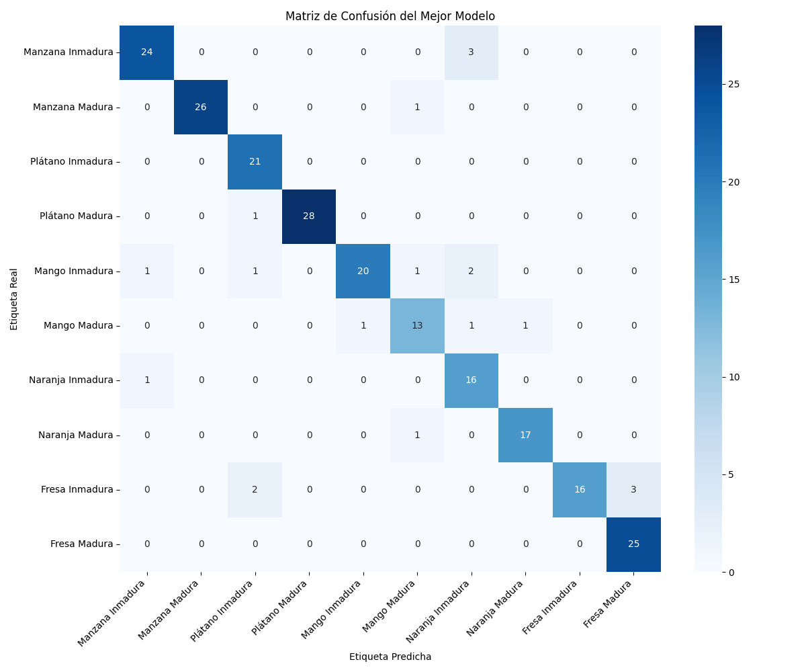
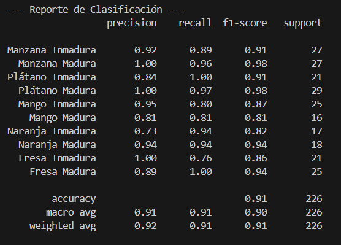

# Clasificador de Maduración de Frutas con ResNet50

Este proyecto fue presentado como trabajo en el curso de Percepción y Visión por Computadora, utiliza un modelo de redes neuronales profundas (ResNet50) para clasificar la maduración de 5 tipos de frutas (manzana, plátano, mango, naranja, fresa).

## Descripción

El clasificador fue entrenado con un conjunto de datos de imágenes de frutas maduras e inmaduras. Se usó el dataset [RawRipe](https://sites.google.com/site/koteswarraojerripothula/research-group/fruit-maturity-recognition). Se utilizó la arquitectura ResNet50 de Keras sobre TensorFlow para entrenar el modelo.

## Resultados

Se consiguió una precisión del 91 %.

A continuación se muestra la matriz de confusión de las predicciones del modelo:

También el reporte de clasificación:

## Requisitos

Este proyecto requiere Python y las siguientes dependencias:

- TensorFlow
- Keras
- NumPy
- Matplotlib
- OpenCV
- PIL (Python Imaging Library)
